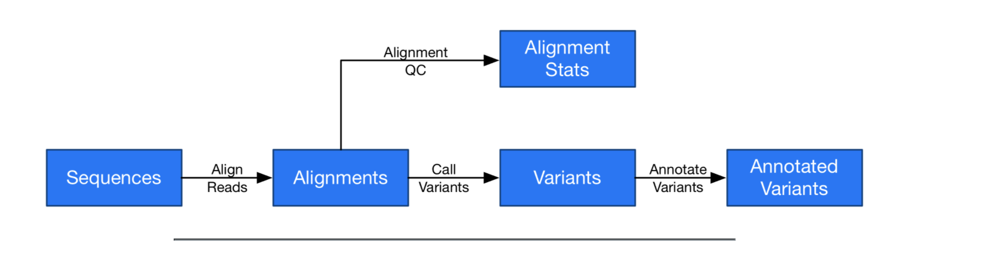
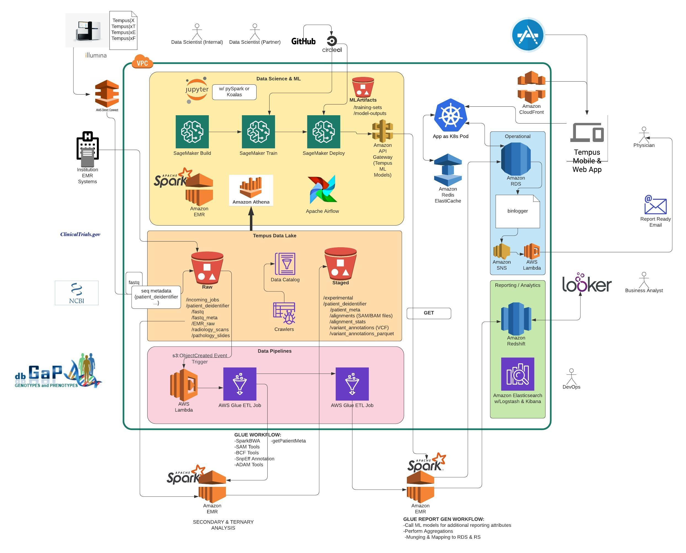
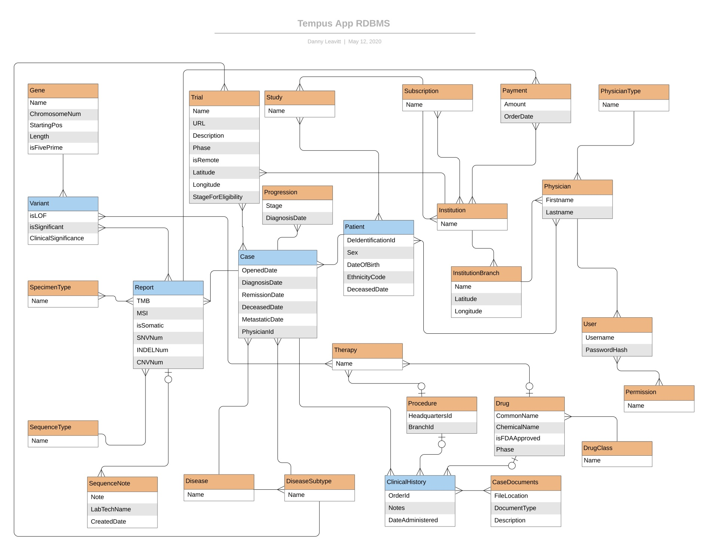

# Tempus Genomic Machine Learning Proposal
Architecture proposal for a self-service bioinformatics machine learning platform in AWS

### Assumptions


- DNA and RNA sequencing data along with patient meta data are foundational for ML model development at Tempus. Deep learning models may also be designed to detect malignancies in radiological imagery and pathology slides. Most often, common ML algorithms (k-means, regression, deep learning) are used with common frameworks (sklearn, tensorflow, mxnet, etc). Occasionally, custom algos and frameworks may need to be used.



- Processing sequencing data requires a computationally expensive set of steps called "secondary analysis" which align and map raw fastq files to a reference genome to produce a BAM file. BAM is a compressed, binary file representing the pieced-together sequenced genome. Next, a variant call file is produced (VCF) that represents all the genetic mutations -- Single Nucleotide Polymorphisms (SNPs), nucleotide insertions or deletions (indels). Finally, the mutations in the VCF file are cross referenced with third party databases to annotate the VCF with clinical/diagnostic information regarding the mutations (ternary analysis). 

- For business or financial reasons, Tempus would like to perform it's own secondary and ternary analysis on patient sequences rather than outsourcing to third party platforms like illumina BaseSpace Hub.

- Data scientists and machine learning engineers often process, analyze, and train models with data volumes in the hundreds of Gigabytes or Terabytes meriting the use of distributed computing systems like Spark with AWS EMR. Still, scientists are more comfortable working with libraries like Pandas designed for single process, in-memory data manipulation. If at all possible, reduce any learning curve associated with introducing a new platform.

- Minimizing the time it takes to go from genome sequencing to patient report is critical. Faster reports mean more nimble treatment decisions and better patient outcomes. Quicker sequence processing also helps data scientists experiment faster leading to quicker breakthroughs.

- Illumina machines are not capable of streaming. Lab techs archive output files and can upload this archive. If streaming were possible, I may have altered the sequencing pipeline, front-loading the secondary analysis workflow with a kinesis streaming queue to speed up processing.



### Tempus Data Lake, Data Cataloging & ETL

Leveraging a data lake model seems especially advantageous for a business model revolving around genomics. Each patient sequence on an illumina machine produces one or two hundred GB of raw fastq and imagery files. Secondary analysis produces SAM, BAM, and VCF files that are similarly as large. Patients may undergo multiple types of sequencing (Whole exome, RNA-Seq) and on multiple occasions during treatment. Aside from Tempus patients, data scientists may wish to pull in external datasets from NIH or NCBI studies. This is a large amount of data and would be expensive to load completely into columnar, pay by storage DW stores like Redshift or Snowflake. Keeping all this data stored in a collection of s3 buckets that make up a data lake effectively separates storage from compute. S3 is durable up to 11 nines, super cheap, can be encrypted at rest via server side encryption, and can serve as the underlying file system for AWS EMR, Redshift (via Redshift Spectrum) and Athena.

More specifically to this challenge, data scientists building models with genomic data may need access to raw data and the data lake model facilitates saving all data. A data scientist may want to perform their own secondary analysis on raw fastq files using different alignment algos, for instance. Also, any papers published in science journals will require these raw files for peer review. 

The data lake in my proposal is fed principally by uploads of patient sequence data at Tempus' Chicago labs and by polling various EMR systems of the patients' health care provider. For sequencing data, a private, dedicated bridge is created via AWS Direct Connect between Tempus' Chicago Lab and Tempus' AWS VPC. Lab techs will archive files from a completed run and write to Tempus Data Lake's S3 Raw bucket. From there a lambda triggered on s3:ObjectCreated will unarchive and upsert files into a `{patient_id}/{fastq}` prefix. Finally the lambda will trigger an AWS glue workflow for secondary analysis.

AWS Glue performs multiple duties in this architecture. Glue has a concept of workflows similar to DAGs in Apache Airflow. Tasks in these workflows run on a Spark EMR cluster outside of your VPC, so you simply need to write the pySpark job; no managing an EMR cluster. Here, I've set up a series of these jobs with secondary and ternary bioinformatics tools optimized for running in parallelized environments: SparkBWA, SAM Tools, BCF Tools, SnpEff Annotation, ADAM Tools. The output BAM and VCF files will be written to a patient_id prefix in the `Staged` bucket. ADAM Tools also converts annotated VCF files to Parquet, a columnar format, optimized for use with EMR or Athena queries. Leveraging Spark in this workflow is key to expediting analysis.

Running concurrently in this Glue DAG is a `getPatientMeta` task. Presumably, the lab includes a common patient de-indentification id as well as an id for the health care provider. This task will query a persistent kv store like DynamoDB to grab an `api_url`, `api_key` for the give health care provider and then poll the health care provider EMR system for that patient's clinical history, radiology imagery, etc. A core library will be maintained leveraging a factory pattern to abstract the specifics of calling and massaging data for the different EMR systems and providers. Failure to grab patient_meta will result in an ERROR being sent to an ELK stack which will trigger an alarm to inform engineers to manually intervene. I envision a similar nightly Glue task to sync all patient data from health care systems to Tempus.

Upon completion of this workflow, Glue will trigger another workflow to do any additional transformations and send sequencing results to downstream data stores like RDS to serve the core app as well as Redshift for business intelligence. At this stage, I envision Glue possibly calling ML models produced and deployed with Sagemaker to augment reporting data with predictions before delivering data downstream. For examples, models making predictions on radiology imagery or likelihood for success with a specific drug could be called and incorporated.

Mapping from the data lake to downstream data stores should be straightforward with Glue. Initially, Glue crawlers will be run on Raw and Staged buckets to auto-generate a schema/data catalog. Once the catalog is manually fine tuned, Glue can generate the Spark mapping task for syncing with downstream data stores. This task can then also be manually fine tuned.

The catalog will also serve another important purpose in that it allows performant querying on the data lake itself. Athena, an AWS product that sits on top of Presto, will utilize the catalog to serve SQL queries to data scientists interested in building/exploring training sets. Results from queries can be easily converted to pandas dataframes for further exploration. While the data visualization team and business analysts may prefer to use more massaged downstream data in Redshift with a BI tool like Looker, the ability to perform SQL on all data is a nice to have. You can even query the data lake directly through redshift via redshift spectrum.

Smart partitioning of data in this lake will aid in performance and requires more discussion of common use cases with data scientists. I chose to partition by patient id here, but I could see partitioning patients by disease (breast cancer, lung cancer, etc), by region or both depending on the most common types of cohorts grabbed by data scientists. I also read about partitioning sequencing results by chromosome, gene or by dividing the nucleotides of a genome into equal buckets (chromosomes have variable numbers of nucleotides so partition by chromosomes yields uneven buckets). Partitioning the genomic info could aid in highly parallel genomic processing applications and queries for specific areas of the genome.

Data scientists in need of speedy sequence analysis may also drop fastq files in the raw bucket in the same way a lab tech would. However, they may also include a manifest file describing alternate parameters for mapping and alignment (i.e., use of different well known algorithms) as well as alternate reference genomes to use. The same lambda function described will pass these params to the Glue workflow. Glue will deliver the resulting files from these data science requested jobs to a special `/experimental` prefix in the Staged bucket.

The infrastructure described will be codified via Terraform and versioned in git so modifications can be tracked.

### Machine Learning Infrastructure w/Sagemaker	

Without leveraging machine learning platform and sensible CI/CD pipelines, model building can get messy fast: Data scientists silo their training sets and jupyter notebooks on disparate local machines; training a single model takes days as scientists find it difficult to train on clustered environments; training sets and the resulting model weights are strewn about and unversioned, making retracing the development life cycle impossible. I'd like to solve these problems with my solution.

First, which platform to choose? I looked at H20 and Sagemaker. H20 has some really nifty ML abstraction layers like "Driverless AI" that just about allow generalist software engineers to develop models. Both platforms make it simple for data scientists to spin up Jupyter notebooks for feature exploration and choose pySpark kernels if Spark on EMR is necessary. Both have tools for automated hyperparameter tuning and seamless training on clustered environments. Model deployment is where Sagemaker really stood out. For deployment, H20 auto-generates python, Java or lambda code that you then have to figure out how to deploy. In Sagemaker, a single click on a trained model can deploy it as a REST endpoint behind AWS API Gateway with default autoscaling policies and even A/B testing against the previous version of said model. All of the popular ML frameworks and algos are supported so I'd imagine a majority of the time Tempus data scientists would simply specify their training set, algo of choice and use Sagemaker's standard containers for training and deploy. If a customer framework or algo is needed, Sagemaker allows custom Docker containers to be specified.

For the model build/exploratory phase, I have Tempus and partner data scientists tapping into Sagemaker Build launching notebooks and choosing between pyspark, vanilla python or R. Pyspark notebooks can leverage a Spark/EMR cluster provisioned for the ML team sitting on the data lake. Alternatively, data scientists can use an aws library like boto to grab data lake data via SQL through Athena. EC2 instances with these exploratory notebooks will persist in the Sagemaker console for sharing and auditability.

Once a training set is decided upon for a given model, the data scientist would then copy the set to the MLArtifacts bucket at the `training-sets` prefix. Versioning would be turned on for this bucket so the state of a given set at any given time can be tracked as additions or removals from the set are made. Next, a git repo for that model would be created with the following files at the root:

1. manifest.json - contains a version number that the CI will autoincrement with each build. Also general meta data about the project

2. config.json - ML configuration needed for Sagemaker Train (framework, algo, hyperparams, data_set_location, # nodes to train on, etc)

3. .circleci - CircleCI file for CI build pipeline

Upon commit, CircleCI (or Jenkins or CodePipeline) will increment the manifest.json version number and dispatch to Sagemaker Train, passing params from config.json. By default, CircleCI will tell Sagemaker to store model weights in `s3://ModelArtifacts/model-outputs` with the version number prepended to the filename. In this way, both the final model weights and the training sets used can be traced to the specific commit (i.e., training) in git. Other important artifacts like model performance against its test set will be sent to the ModelArtifacts bucket for evaluation before a deployment decision.

Two additional parameterized CircleCI jobs will be triggered to complete the lifecycle and take models to production. Calling the `deploy_candidate` job with the model name and version number will have Circle delegate to Sagemaker Deploy to launch the model as a REST endpoint behind API Gateway with a private endpoint url. The new model is then staged for testing. Once the team is satisfied with the new model, a subsequent `promote_candidate` job can be called with the model name and version number to tear down the existing production model and replace it with the new model. At past jobs, I've had good success with "ChatOps", making CI jobs like this callable via Slack in a "#Deployments" channel that interested parties can watch. This creates a nice little log of the most recent deployments and is a big help in troubleshooting prod issues.


### Dask vs Koalas

I know that Tempus data scientists have adopted Dask in order to speed up pandas workflows. From my research, I've learned that Dask speeds up pandas operations by parallelizing them across multiple processes on a single machine. It also more efficiently streams data between disk and RAM, making it better for working with large datasets. Pandas, by contrast, is single threaded. Both libraries are only designed for running on a single node, not a distributed compute like Spark/Hadoop.

To take things to the next level, I'd recommend experimenting with Databrick's koalas python library. Koalas implements the same api as pandas but sits on top of Spark dataframes. In essence, data scientists can start leveraging Spark without the learning curve. Tempus data scientists can simply create a new Sagemaker notebook with pySpark from the console or aws cli and point it at the EMR cluster. Now just import koalas and use it as if it were pandas while enjoying the performance of Spark.

### Running the koalas demo

I've included a mini demo script I put together running pandas alongside koalas. Koalas has the very same apis for importing and manipulating dataframes as pandas but instead sits atop Spark dataframes and can leverage the speed of distributed computing. The project runs on pySpark in a docker container.

Ensure you have docker installed on your machine.

```
docker build -t tempus_proj/koalas_demo:1.0 .
docker run -ti --name koalas_demo tempus_proj/koalas_demo:1.0
```

### Tempus App, Operational Data Stores 
	
Per my diagram, I imagine the Tempus app sits on RDS (postgres or mysql) downstream of the data lake. I took a little time at the beginning of this exercise to set down a normalized, relational schema for Tempus' physician-facing app to better understand the product. Having no access to the actual product, I gleaned most of this from screen captures in Tempus promotional videos. This is by no means complete, just a basic scaffold to help put my thoughts together for the challenge. 



The web frontend is a React app served via a Cloudfront CDN distribution. Mobile apps are served from their respective app stores. The backend is a REST api, containerized and deployed as a pod on Kubernetes. K8s takes care of horizontally auto scaling based on incoming traffic. 

RDS streams all write activity to a binlogger which is sent to SNS that filters events by table. From here lambdas can react to various events. Pictured here, is a lambda listening for new report records added at the completion of the Glue workflow described. This lambda could then send an email to the physician to inform of the report completion. Another application I see here is that upon report completion, a lambda could preload and aggregate any dataframes necessary for report visualizations (i.e., cohort visualizations) and write them to ElastiCache/Redis. Provided these visualizations don't need to be up-to-the-minute fresh, this pre-caching mechanism would help speed up app response times.


